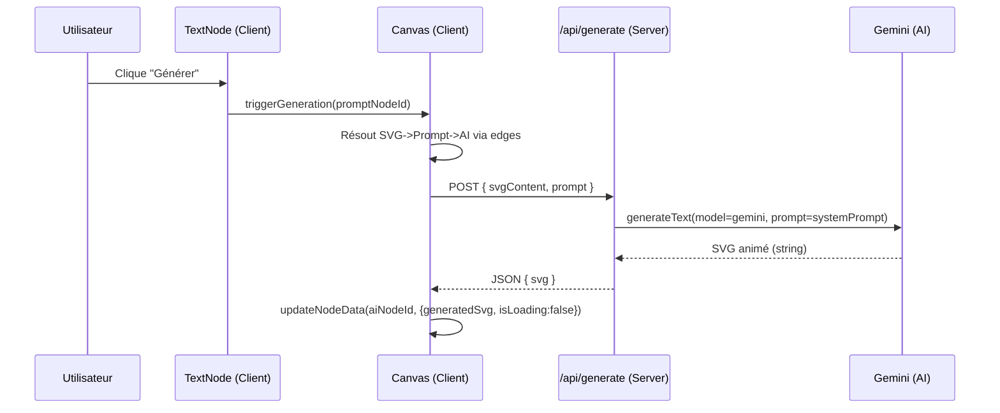

# SVG AI Studio — Architecture

## Objectif
Construire un outil node-based permettant d’importer un SVG statique, de le connecter à un nœud Gemini (via Vercel AI SDK / Google Gemini), et de générer un SVG animé en **préservant le design original**.

## Stack
- Next.js (App Router) + React
- Canvas node-based: React Flow (`@xyflow/react`)
- IA: Vercel AI SDK (`ai`) + provider Gemini (`@ai-sdk/google`)

## Vue d’ensemble
L’application est composée de:
- **UI Canvas** (client): rendu React Flow, nœuds, edges, interactions.
- **API Next.js** (server): endpoint `/api/generate` qui appelle Gemini.
- **Génération**: prompt système + SVG + instruction → SVG animé (réponse).

### Diagramme (contexte)
```mermaid
flowchart LR
  U[Utilisateur] -->|Drag/Zoom/Connect| UI[Canvas React Flow (Client)]
  UI -->|POST /api/generate| API[Next.js Route Handler (Server)]
  API -->|generateText| AI[Vercel AI SDK + Gemini]
  AI -->|SVG animé| API
  API -->|JSON {svg}| UI
  UI -->|Preview + Download| U
```

## Organisation des fichiers
- `app/page.tsx`
  - Monte le composant principal `Canvas`.
- `components/Canvas.tsx`
  - Gère l’état React Flow (nodes/edges)
  - Ajout dynamique de nœuds
  - Résolution des connexions `SVG -> Prompt -> AI Generation`
  - Appel API server: `fetch('/api/generate')`
- `components/nodes/*`
  - `InputSvgNode.tsx`: source SVG (upload/paste)
  - `TextNode.tsx`: instruction d’animation + bouton générer
  - `AiGenerationNode.tsx`: preview résultat, download, régénérer
- `app/api/generate/route.ts`
  - Endpoint server qui valide les entrées
  - Vérifie `GOOGLE_GENERATIVE_AI_API_KEY`
  - Appelle `lib/gemini.ts`
- `lib/gemini.ts`
  - Fonction `generateAnimatedSvg(svgContent, prompt)`
  - Construit le prompt système et appelle `generateText`
- `styles/flow.css`
  - Thème sombre (fond, surbrillance hover/selected)

## Flux de données (runtime)

### 1) Edition sur canvas
- L’utilisateur ajoute des nœuds via le Panel.
- Il connecte les ports (handles) pour former une chaîne:
  - `Input SVG` (source) → `Text Prompt` (prompt) → `AI Generation` (cible)

### 2) Déclenchement génération
- Action: bouton **Générer** dans un `Text Prompt`.
- `TextNode` appelle `window.triggerGeneration(promptNodeId)`.
- Dans `Canvas`:
  - On remonte à la source du prompt via les edges.
  - On trouve un `AI Generation` connecté en sortie.
  - On lance `runGeneration(svgNodeId, promptNodeId, aiNodeId)`.

### Diagramme (séquence)


## Modèle de nœuds
Chaque node React Flow a `data` (type `NodeData`) avec:
- `svgContent?`: présent sur `Input SVG`
- `prompt?`: présent sur `Text Prompt`
- `generatedSvg?` + `isLoading?`: présent sur `AI Generation`

## Sécurité & secrets
- La clé API n’est **jamais** stockée côté client.
- Variable requise côté serveur:
  - `GOOGLE_GENERATIVE_AI_API_KEY`

## Limites actuelles / prochaines étapes
- Gestion fine des erreurs dans l’UI (toast non bloquant plutôt que `alert`).
- Stratégie multi-input: accepter une génération itérative (AI Gen → Prompt → AI Gen).
- Streaming (optionnel) pour afficher progressivement le SVG pendant la génération.
- Validation SVG (taille, scripts, sanitization) avant rendu.
